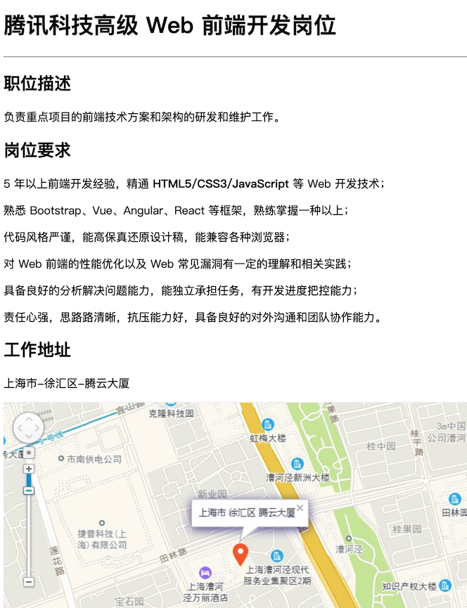
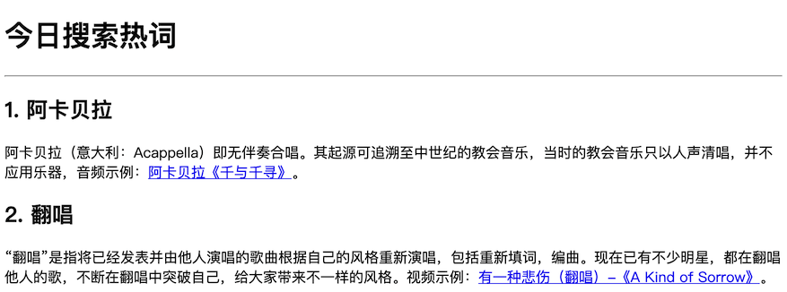

# HTML 认知篇

## 一. 基础概念

> 笔记对应视频：[P2 ~ P9](https://www.bilibili.com/video/BV1Kg411T7t9?p=2)。

### 01. 网页组成和本质

1. 网页由哪些部分组成？
   - 文字、图片、音频、视频、超链接等
2. 网页的背后本质是什么？
   - 前端程序员写的代码
3. 网页代码是通过什么软件转换成用户眼中页面的？
   - 浏览器

### 02. 浏览器

1. 浏览器：显示、运行网页的平台
2. 常见的五大浏览器：
   1. IE（Edge）
   2. 火狐 Firefox
   3. 谷歌 Chrome
   4. Safari（苹果）
   5. 欧朋 Opera
3. 渲染引擎：
   1. 浏览器中专门对代码进行解析渲染的部分
   2. 渲染引擎不同，解析相同代码时的速度、性能、效果不同
   3. **谷歌浏览器**的渲染引擎速度快、性能高、效果好，前端开发必备

### 03. Web 标准

1. HTML：结构，决定网页的内容和结构
2. CSS：表现，决定网页的外观和样式
3. JavaScript：行为，决定网页交互和动态效果

### 04. HTML 感知

HTML（Hyper Text Markup Language）：超文本标记语言。

- 通过**标签**来描述网页中的**文本**、**图片**、**音频**或**视频**等内容
- HTML 文件本质是一个**文本文件**，常用的扩展名是 `html`

体验代码：

```html
<strong>你猜，这个字是加粗的吗？</strong>
```

#### 标签的基础语法

```html
<标签名>内容</标签名>
```

1. **标签名**在 `<>` 中，不同的标签名表示不同的含义
2. **结束标签名**前有一个 `/`

### 05. HTML 骨架

1. `html`：网页的整体
2. `head`：网页的头部
   - `title`：网页的标题，显示在浏览器的页面附签中
3. `body`：网页的主体，显示在浏览器的主窗口中

示例代码如下：

```html
<html>

<head>
  <title>网页的标题</title>
</head>

<body>
  网页的主体内容
</body>

</html>
```

### 06. VSCode 的简介和使用

- 网页文件本质上是一个**文本文件**
- VS Code：速度快、体积小、插件多，前端开发必备

VSCode 下载地址：<https://code.visualstudio.com>

必备插件：

1. **Chinese (Simplified) Language Pack for Visual Studio Code** 简体中文插件
2. **open in browser** 打开浏览器插件

#### VSCode 小贴士

1. 快速生成页面骨架结构：`! + tab`
   - 文件的扩展名要是：`html`
   - `!` 是英文的标点，中文的 `！` 无效
2. 保存文件：`ctrl + s`
   - 如果文件没有保存，**文件名**边上会有一个**白色小圆点**
3. 在浏览器中查看页面 `alt + b`，需要安装 **open in browser** 插件

### 07. 注释

- 作用：为代码添加的描述性信息，帮助开发人员理解代码
  - 写注释是个好习惯
  - 浏览器执行代码时会忽略所有的注释
- 快捷键：`ctrl + /`

### 08. 标签的组成和关系

#### 标签结构

```html
<标签名>包裹的内容</标签名>
```

1. `<标签名>` 被称为**开始标签**，不同的标签名表示不同的含义
2. `</标签名>` 被称为**结束标签**，与开始标签成对出现，标签名前有一个 `/`
3. **开始标签**和**结束标签**中间包裹要显示的文本内容，又被称为**双标签**
4. 少数标签只有**开始标签**，有特殊的含义，无法包裹内容，又被称为**单标签**，例如：
   - `br` 换行
   - `hr` 水平分隔线

#### 标签关系

1. 父子关系（嵌套关系）
2. 兄弟关系（并列关系）

## 二. HTML 标签

> 笔记对应视频：[P10 ~ P20](https://www.bilibili.com/video/BV1Kg411T7t9?p=10)。

### 01. 标题和段落

#### 标题标签

1. 场景：在新闻和文章的页面中，用来突出显示文章主题
2. 标签名：`h1`、`h2`、`h3`、`h4`、`h5`、`h6`
3. 语义：标题一、标题二、标题三、标题四、标题五、标题六
4. 特点：
   1. 文字都有加粗效果
   2. 标题文字通常比普通文字大，`h1` → `h6` 逐渐减小
   3. 独占一行

> 小技巧：`ctrl + d` 可以连续选中相同的单词。

示例代码如下：

```html
<h1>1级标题</h1>
<h2>2级标题</h2>
<h3>3级标题</h3>
<h4>4级标题</h4>
<h5>5级标题</h5>
<h6>6级标题</h6>
```

#### 段落标签

1. 场景：在新闻和文章的页面中，用来显示段落文字
2. 标签名：`p`
3. 语义：段落文字
4. 特点：
   1. 段落之间存在间隙
   2. 独占一行
   3. 段落文字较多时会自动换行

示例代码如下：

```html
<p>前端即网站前台部分，运行在 PC 端，移动端等浏览器上展现给用户浏览的网页。随着互联网技术的发展，HTML5，CSS3，前端框架的应用，跨平台响应式网页设计能够适应各种屏幕分辨率，合适的动效设计，给用户带来极高的用户体验。</p>
```

### 02. 换行和水平线标签

#### 换行标签

1. 场景：让文字强制换行显示
2. 标签名：`br`
3. 语义：强制换行
   1. 单标签
   2. 文字强制换行，上下文字的间隙没有 `p` 标签大

#### 水平线标签

1. 场景：显示一条水平线
2. 标签名：`hr`
3. 语义：主题的分割转换
4. 特点：
   1. 单标签

示例代码如下：

```html
<h1>前端 （网站前台部分）</h1>
<hr>
<p>端即网站前台部分，运行在 PC 端，移动端等浏览器上展现给用户浏览的网页。<br>随着互联网技术的发展，HTML5，CSS3，前端框架的应用，跨平台响应式网页设计能够适应各种屏幕分辨率，合适的动效设计，给用户带来极高的用户体验。
</p>
```

### 03. 文本格式化标签

1. 场景：让文字具有**加粗**、<u>下划线</u>、*倾斜*、~~删除线~~等效果
2. 标签名和效果：
   1. `strong`、`b`：**加粗**
   2. `ins`、 `u`：<u>下划线</u>
   3. `em`、`i`：*倾斜*
   4. `del`、`s`：~~删除线~~

示例代码如下：

```html
<strong>加粗</strong>
<b>加粗</b>
<br>
<ins>下划线</ins>
<u>下划线</u>
<br>
<em>倾斜</em>
<i>倾斜</i>
<br>
<del>删除线</del>
<s>删除线</s>
```

### 04. 图片标签

1. 场景：在网页中显示图片
2. 标签名：`img`
3. 代码：``
4. 特点：
   1. 单标签
   2. 需要在 `src` 属性中设置图片的路径

#### 4.1 标签的属性

1. 标签的属性写在开始标签内部 → **表示这个标签有什么特点**
2. 一个标签可以同时有多个属性，属性之间没有顺序 → **一个标签可以有多个特点**
3. 属性编写特点：
   1. 属性之间使用空格隔开
   2. 属性名没有引号，属性值用双引号包裹
   3. 标签名和属性名之间要用空格隔开，不能连在一起

#### 4.2 图片的属性

| 属性名 | 功能                                 |
| ------ | ------------------------------------ |
| alt    | 图片加载失败时，显示的替换文本       |
| tltie  | 当鼠标悬停在图片只上时，会显示的文本 |
| width  | 宽度数值                             |
| height | 高度数值                             |

提示：

1. `title` 属性还可以用于其他标签
2. `width` & `height`
   1. 如果只设置一个，另一个会跟着等比例调整
   2. 如果同时设置宽和高，图片有可能会变形

示例代码如下：

```html

```

#### 4.3 路径

1. 路径的作用：通过路径能够找到想要的资源，例如图片文件
2. 路径的分类：
   1. 绝对路径（不常用）：直接到达目标位置，通常从**盘符**或者网址 `http://www.xxx.com` 开始；
   2. **相对路径**（常用）：从当前文件出发找目标文件的过程
3. 相对路径的写法：
   1. 同级目录：`./` 或者直接写
   2. 下级目录：`子目录/` 或者 `./子目录/`
   3. 上级目录：`../`

示例代码如下：

```html
<h2>同级文件</h2>


<hr>

<h2>下级目录</h2>


<h2>上级目录</h2>


```

### 05. 音频标签

1. 场景：在网页中插入音频
2. 标签名：`audio`
3. 代码：`<audio src="" controls></audio>`
4. 属性：

   | 属性名   | 功能                         |
   | -------- | ---------------------------- |
   | src      | 音频的路径                   |
   | controls | 显示播放控件                 |
   | autoplay | 自动播放（部分浏览器不支持） |
   | loop     | 循环播放                     |

5. 支持的文件格式：`.mp3`（**推荐**）、`.wav`、`.ogg`

示例代码如下：

```html
<audio src="./assets/music.mp3" controls loop></audio>
```

### 06. 视频标签

1. 场景：在网页中插入视频
2. 标签名：`video`
3. 代码：`<video src="" controls></audio>`
4. 属性：

   | 属性名   | 功能                                        |
   | -------- | ------------------------------------------- |
   | src      | 视频的路径                                  |
   | controls | 显示播放控件                                |
   | autoplay | 自动播放（谷歌浏览器需要配合 `muted` 静音） |
   | muted    | 静音                                        |
   | loop     | 循环播放                                    |
   | width    | 宽度                                        |

5. 支持的文件格式：`.mp4`（**推荐**）、`.webm`、`.ogg`

示例代码如下：

```html
<video src="./assets/video.mp4"
   controls
   autoplay
   muted
   loop
   width="400"></video>
```

### 07. 链接标签

1. 场景：点击链接从一个页面跳转到另一个页面
2. 标签名：`a`
3. 代码：`<a href="目标地址">链接名称</a>`
4. 属性：

   | 属性名 | 功能                    |
   | ------ | ----------------------- |
   | href   | 跳转路径                |
   | target | `_blank` 在新窗口中打开 |

5. 链接形式：
   1. 外部链接：完整的网页地址
   2. 内部链接：跳转到当前网站的其他网页，可以使用相对路径
   3. `#` 空链接：在开发初期，不确定跳转地址时使用

6. 特点：
   1. 双标签
   2. 包裹的内容是链接的名称或提示，例如：**百度一下，你就知道**

示例代码如下：

```html
<!-- 外部链接 -->
<h2>外部链接</h2>
<a href="https://www.baidu.com" target="_blank">百度一下，你就知道</a>
<br>
<!-- 内部链接 -->
<h2>内部链接</h2>
<a href="./p010-标题和段落标签.html">点我啊</a>
<!-- 空链接 -->
<h2>空链接</h2>
<a href="#">不知道去哪里</a>
```

#### 扩展 - `href =""` 和 `a href ="#"` 有什么区别？

- `a href =""` 默认打开的还是当前页面，**会刷新页面**，重新打开。
- `a href ="#"` 浏览器地址栏网址后面会多显示 1 个 `#`，**不会刷新页面**，回到页面顶部。

## 三. 综合案例

### 01. 腾讯招聘

#### 腾讯招聘 - 案例目标

使用合适的标签实现以下案例效果：



#### 腾讯招聘 - 案例素材

1. 文字素材

   ```txt
   腾讯科技高级 Web 前端开发岗位

   职位描述
   负责重点项目的前端技术方案和架构的研发和维护工作。

   岗位要求
   5 年以上前端开发经验，精通 HTML5/CSS3/JavaScript 等 Web 开发技术；
   熟悉 Bootstrap、Vue、Angular、React 等框架，熟练掌握一种以上；
   代码⻛格严谨，能⾼保真还原设计稿，能兼容各种浏览器；
   对 Web 前端的性能优化以及 Web 常见漏洞有一定的理解和相关实践；
   具备良好的分析解决问题能力，能独立承担任务，有开发进度把控能力；
   责任心强，思路路清晰，抗压能力好，具备良好的对外沟通和团队协作能力。

   工作地址
   上海市-徐汇区-腾云大厦
   ```

2. 图片素材

   

#### 腾讯招聘 - 参考代码

```html
<h1>腾讯科技高级 Web 前端开发岗位</h1>
<hr>
<h2>职位描述</h2>
<p>负责重点项目的前端技术方案和架构的研发和维护工作。</p>
<h2>岗位要求</h2>
<p>5 年以上前端开发经验，精通 <strong>HTML5/CSS3/JavaScript</strong> 等 Web 开发技术；</p>
<p>熟悉 Bootstrap、Vue、Angular、React 等框架，熟练掌握一种以上；</p>
<p>代码⻛格严谨，能⾼保真还原设计稿，能兼容各种浏览器；</p>
<p>对 Web 前端的性能优化以及 Web 常见漏洞有一定的理解和相关实践；</p>
<p>具备良好的分析解决问题能力，能独立承担任务，有开发进度把控能力；</p>
<p>责任心强，思路路清晰，抗压能力好，具备良好的对外沟通和团队协作能力。</p>
<h2>工作地址</h2>
<p>上海市-徐汇区-腾云大厦</p>

```

### 02. 今日热搜

#### 今日热搜词 - 案例目标

1. 使用合适的标签实现以下案例效果：

   

2. 点击页面中的**超链接**，**在新窗口中**显示对应的音频或视频页面。

#### 今日热搜词 - 案例素材

1. 文字素材

   ```txt
   今日搜索热词

   1. 阿卡贝拉
   阿卡贝拉（意大利：Acappella）即无伴奏合唱。其起源可追溯至中世纪的教会音乐，当时的教会音乐只以人声清唱，并不应用乐器，音频示例：阿卡贝拉《千与千寻》。

   2. 翻唱
   “翻唱”是指将已经发表并由他人演唱的歌曲根据自己的风格重新演唱，包括重新填词，编曲。现在已有不少明星，都在翻唱他人的歌，不断在翻唱中突破自己，给大家带来不一样的风格。视频示例：有一种悲伤（翻唱）-《A Kind of Sorrow》。
   ```

#### 今日热搜词 - 参考代码

1. index.html

   ```html
   <h1>今日搜索热词</h1>
   <hr>
   <h2>1. 阿卡贝拉</h2>
   <p>阿卡贝拉（意大利：Acappella）即无伴奏合唱。其起源可追溯至中世纪的教会音乐，当时的教会音乐只以人声清唱，并不应用乐器，音频示例：<a href="./music.html"
       target="_blank">阿卡贝拉《千与千寻》</a>。</p>
   <h2>2. 翻唱</h2>
   <p>“翻唱”是指将已经发表并由他人演唱的歌曲根据自己的风格重新演唱，包括重新填词，编曲。现在已有不少明星，都在翻唱他人的歌，不断在翻唱中突破自己，给大家带来不一样的风格。视频示例：<a href="./video.html"
       target="_blank">有一种悲伤（翻唱）-《A Kind of Sorrow》</a>。</p>
   ```

2. music.html

   ```html
   <h1>阿卡贝拉《千与千寻》</h1>
   <hr>
   <h2>音频</h2>
   <audio src="./images/music.mp3" controls loop></audio>
   ```

3. audio.html

   ```html
   <h1>有一种悲伤（翻唱）-《A Kind of Sorrow》</h1>
   <hr>
   <h2>视频</h2>
   <video src="./images/video.mp4" controls autoplay muted loop></video>
   ```
